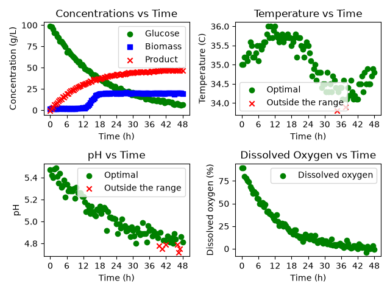

# Bioprocess Batch Monitor

A Python-based tool for analyzing fermentation batch data and generating process monitoring dashboards and summary tables.

## Overview

The goal of this project is to analyze fermentation batch process data and provide a clear way to monitor process performance. The program evaluates pH and temperature measurements against specified operating ranges and generates visual dashboards for each batch. It also creates summary tables containing key batch-level performance metrics and final product concentrations.

## Features

- Reads fermentation process data from CSV files.
- Extracts and analyzes data for individual fermentation batches.
- Identifies pH and temperature measurements that are within or outside specified operating ranges.
- Generates a four-panel dashboard for each batch showing concentration profiles, temperature, pH, and dissolved oxygen over time.
- Highlights acceptable and out-of-range pH and temperature measurements using different plot markers.
- Calculates the percentage of pH and temperature measurements within their acceptable ranges.
- Creates batch-level summary tables containing process performance metrics and final product concentrations.
- Exports dashboards as PNG images and summary tables as CSV files.

## Technologies Used

- Python 3.14.7
- pandas 3.0.5
- Matplotlib 3.11.0

## Code Design

The `BioprocessMonitor` class contains the methods used to load and analyze the fermentation dataset, extract individual batches, evaluate operating conditions, and export results.

When `main.py` is run, two `BioprocessMonitor` objects are created using different acceptable pH and temperature ranges. For each operating mode, the program processes every fermentation batch and generates a dashboard showing the process variables over time. After all batch dashboards are generated, a summary table is created containing the percentage of pH and temperature measurements within the acceptable ranges and the final product concentration for each batch.

## Dashboard

The dashboard provides a visual overview of the fermentation process for an individual batch. It displays glucose, biomass, and product concentrations, as well as temperature, pH, and dissolved oxygen over time. Temperature and pH measurements within the specified operating ranges are shown separately from measurements outside those ranges.

Below is an example of the tables created:

## Summary Table

The summary table reports the percentage of pH and temperature measurements within their specified operating ranges and the final product concentration for each batch.

| Batch ID | pH Optimal (%) | Temperature Optimal (%) | Final Product Concentration (g/L) |
|---:|---:|---:|---:|
| 1 | 36.08 | 51.55 | 46.5 |
| 2 | 34.71 | 55.37 | 50.8 |
| 3 | 36.99 | 46.58 | 44.6 |
| 4 | 54.12 | 62.35 | 48.6 |
| 5 | 16.51 | 49.54 | 24.7 |

[View the generated CSV file](tables/Summary_Mode_B.csv)